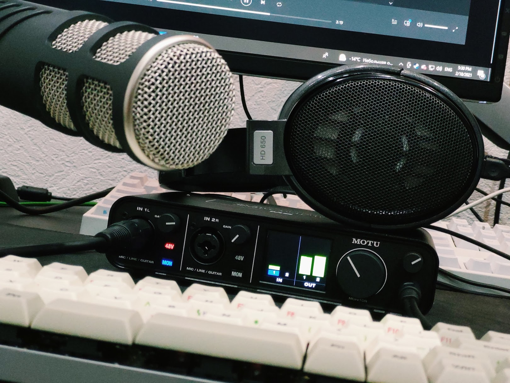

\
\
\

{{}}

\
\
\

У нас новостной лёгкий в подготовке эпизод потому что я собрал себе новый аудиосетап и хочу с ним поиграться сейчас, а не через два месяца (зачёркнуто) потому что в интернете происходит удивительно много интересных вещей разом: у нас есть новаторская атака на корпорации через пакетные менеджеры, у нас есть закрывашая Stadia-студиии Google, и есть Nvidia, сегментирующая рынок под предлогом заботы о геймерах! Fun fun fun.

Но серьёзно, на изображении Rode Procaster, Motu M2 и Sennheiser HD 650, и я счастлив с ними (осталось научиться использовать).

\

<iframe width="100%" height="166" scrolling="no" frameborder="no" allow="autoplay" src="https://w.soundcloud.com/player/?url=https%3A//api.soundcloud.com/tracks/989691592&color=%23ff5500&auto_play=false&hide_related=false&show_comments=true&show_user=true&show_reposts=false&show_teaser=true"></iframe>

\

Альтернативные линки (новые эпизоды могут появляться с некоторым запозданием):

* [Google Podcasts](https://podcasts.google.com/?feed=aHR0cDovL2ZlZWRzLnNvdW5kY2xvdWQuY29tL3VzZXJzL3NvdW5kY2xvdWQ6dXNlcnM6MjM0MzMyOTQvc291bmRzLnJzcw) \
* [Apple Podcasts](https://podcasts.apple.com/ru/podcast/%D1%83%D1%81%D0%B8%D0%BB%D0%B5%D0%BD%D0%B8%D0%B5-%D0%BF%D0%BE%D0%B4%D0%BA%D0%B0%D1%81%D1%82/id1487512789) \
* [Spotify](https://open.spotify.com/show/4dQbxnwJjsz4z9UdCVJR6H) \
* [Castbox](https://castbox.fm/channel/%D0%A3%D1%81%D0%B8%D0%BB%D0%B5%D0%BD%D0%B8%D0%B5%2B-%D0%9F%D0%BE%D0%B4%D0%BA%D0%B0%D1%81%D1%82-id2462850) \
* [Overcast](https://overcast.fm/itunes1487512789) \
* [Яндекс.Музыка](https://music.yandex.ru/album/9244822) \
* [RSS](https://anchor.fm/s/1079e220/podcast/rss) \

\

* [<b>Чуть обособленно: патреон</b>](https://patreon.com/usilenie)

<iframe src="https://yoomoney.ru/quickpay/shop-widget?writer=seller&targets=%D0%98%D0%BB%D0%B8%20%D0%B7%D0%B0%D0%BD%D0%B5%D1%81%D1%82%D0%B8%20%D0%BD%D0%B0%20%D0%BF%D0%B8%D0%B2%D0%BE%20(%D0%BA%D0%BE%D0%B3%D0%BE%20%D1%8F%20%D0%BE%D0%B1%D0%BC%D0%B0%D0%BD%D1%8B%D0%B2%D0%B0%D1%8E%2C%20%D0%BD%D0%B0%20%D0%B0%D1%83%D0%B4%D0%B8%D0%BE%D1%85%D0%BB%D0%B0%D0%BC)%20%D1%80%D0%B0%D0%B7%D0%BE%D0%B2%D0%BE&targets-hint=&default-sum=200&button-text=11&payment-type-choice=on&mobile-payment-type-choice=on&comment=on&hint=&successURL=&quickpay=shop&account=410016665247103" width="100%" height="330" frameborder="0" allowtransparency="true" scrolling="no"></iframe>

---

Линки на упомянутые в выпуске ресурсы:

Атаки на пакетные менеджеры языков программирования:

* [Пропажа left-pad из npm пять лет назад](https://www.theregister.com/2016/03/23/npm_left_pad_chaos/)
* [Left-pad: позиция разработчика](https://kodfabrik.com/journal/i-ve-just-liberated-my-modules)
* [Left-pad: позиция npm](https://blog.npmjs.org/post/141577284765/kik-left-pad-and-npm)
* [Typosquatting пять лет назад](https://incolumitas.com/2016/06/08/typosquatting-package-managers/)
* [Фишинговая атака на репозитории Ruby в прошлом году](https://arstechnica.com/information-technology/2020/04/725-bitcoin-stealing-apps-snuck-into-ruby-repository/)
* [Герой сегодняшнего выпуска](https://medium.com/@alex.birsan/dependency-confusion-4a5d60fec610)
* [Экосистема Haskell также подвержена](https://frasertweedale.github.io/blog-fp/posts/2021-02-12-haskell-dependency-confusion.html)
* [Docker также подвержен](https://twitter.com/vladimir_metnew/status/1359887996661694464)

Остальные материалы:

* [Цитируемый материал "Коммерсанта"](https://www.kommersant.ru/doc/4692079)
* [Эндрю Спинкс: блокировка Google-аккаунта](https://twitter.com/Demilogic/status/1358661840402845696?s=20)
* [Nvidia: пресс-релиз](https://blogs.nvidia.com/blog/2021/02/18/geforce-cmp/)
* [Nvidia: наше решение не ломается](https://www.pcgamer.com/nvidia-ethereum-mining-limiter-cannot-be-hacked/)
* [TSMC: первые 5нм -- для майнинга](https://wccftech.com/tsmc-producing-5nm-asics-for-both-bitmain-and-canaan-in-2020/)
* [On-chip RTOS в GPU Nvidia](https://hal.archives-ouvertes.fr/hal-00853849/document)
* [Фингерпринтинг GPU-ворклоадов](https://sc19.supercomputing.org/proceedings/src_poster/poster_files/spostg129s2-file2.pdf)