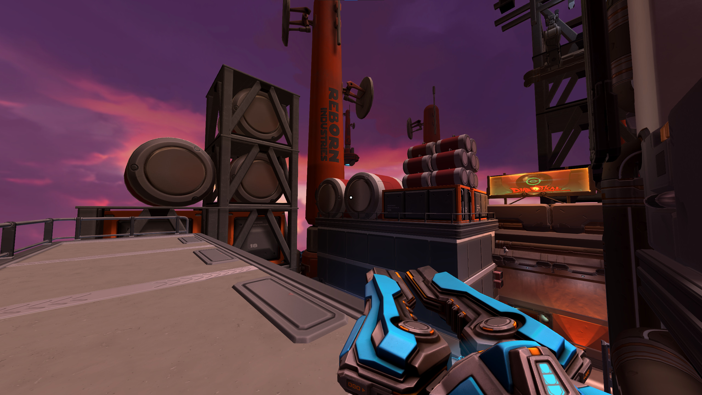
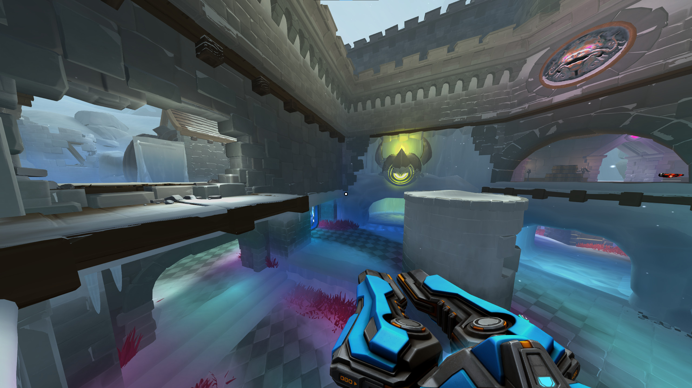
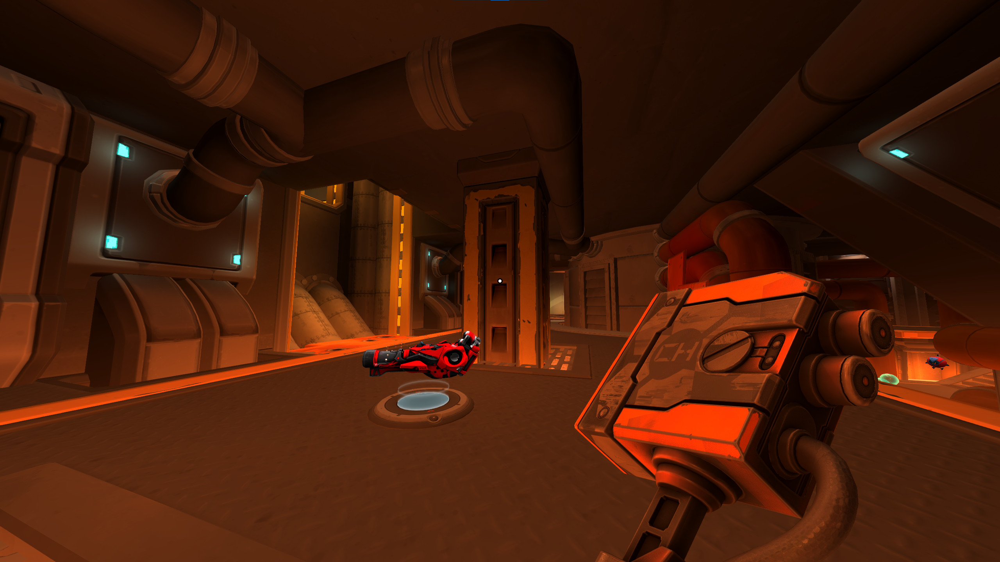

Провёл в очередной раз полночи за Diabotical.

Уже наверное неделю мой типичный день выглядит следующим образом: какое-то время я делаю свои обычные дела, потом вдруг решаю "а не пострелять ли из рейлгана ещё пару раундов", и снова прихожу в себя хорошо если двумя часами позже. Повторить при необходимости (всегда находится).

Я всегда слабел и терял волю перед играми, в которых какого-нибудь базового аспекта механики достаточно, чтобы ввести игрока в глубокий транс на долгие часы и заставить его приближаться к идеалу исполнения, игнорируя более явные цели, которые игра декларирует, подсчитывая приближение к ним в очках. Движение -- одна из самых базовых таких вещей, и во многом синонимичная с интерактивными развлечениями в принципе.

Попадание снарядом в находящийся где-то на другом конце экрана кораблик в Space Invaders, комбо из прыжков по головам врагов в Super Mario, быстро исполненная последовательность в Тетрисе, перемещение вместе с глазом бури в любом приличном шмапе; наконец -- новая трёхмерная эпоха и игры id Software, узаконившие перемещение на своих двоих со скоростью спортивного автомобиля, Quake 3 как непревзойдённый за двадцать лет золотой стандарт.

Какое-то время я был очарован новыми (ну, начиная с четвёртой, когда их ещё кто-то считал, с Modern Warfare) Call of Duty: там, казалось, движение обрело новую естественность, недостижимую для игр постарше физиологичность анимации. Достаточно было однажды провести вечер за ремастером Modern Warfare, чтобы увидеть, как быстро этот подход устарел: игра уже ощущается бесконечно _более_ деревянной, чем космически изящный Quake 3.

Diabotical источники своего вдохновения не скрывает: это Quake 3, созданный сегодня, и я не припомню за последние годы другой игры, которая так праздновала бы комплексный набор эмоций, сообщаемых быстрым, выверенным движением. Изящное перемещение по карте -- основа всего: глазастый шарик несётся по коридору, деловито покачиваясь из стороны в сторону, появление в поле зрения целей и расправа над ними -- вдох и выдох, обязательные фоновые процессы. Главная юзерфрендли-находка Diabotical: не обязательно зубрить потаенные техники, чтобы набирать серьёзную скорость -- достаточно просто зажать кнопку прыжка (не влететь в стену при этом всё же чуть сложнее).

\
\
\


  {{}}
  {{}}
  {{}}


_Во время боя не до скриншотов, но чтоб дать общее представление о графическом исполнении... Да: карты будто нарисованы за ночь уволенным из Blizzard запойным художником. Это ничего, вы на них не будете смотреть. Они созданы специально для того, чтоб вы на них не смотрели._

\
\
\

Но вы всё равно встраиваете все эти уже привычные реверансы в свой ритм. Тут все собрались ради изящества исполнения: просто застрелить соперника было бы невежливо, для этого есть почти все остальные игры в мире, здесь вы должны исполнить танец. Торжество движения, да, но для людей, повидавших виды, и не удивляющихся слишком уж легко.

Здесь за потоком мысли "выпущенная мною вслепую ракета убила противника ровно там, где он и должен был, по моему мнению, появиться" следует не "ух ты", а "**конечно же**". Все собравшиеся знают, как именно должны развиваться события в перестрелке с известными вводными данными. Рейл (поворот к точке фиксации прицела -- летящему вверх противнику -- по плавной грациозной кривой), отойти чуть назад через дверной проём (взгляд медленно отводится в сторону от противника с уважением к последнему, одновременно с этим происходит переключение оружия), соблюдая вековую традицию всадить в него ракету-другую (туда никто не сунется и так, это опять же знак вежливости), снова включить рейлган, дождаться появления противника с противоположной стороны, победный выстрел. В какой ещё современной игре убитый будет радоваться безупречному исполнению комбинации так же чистосердечно, как и вы?

\



\

У меня есть давняя теория: набор впечатлений от относительно высокоуровневой игры в хороший многопользовательский FPS можно предсказать, посмотрев на дизайн лучшего оружия в игре. Unreal Tournament, ASMD Shock Rifle: тёмные пространства, быстрые стычки, исключительно позиционная борьба, противника на дуэльной карте не видно почти никогда. Quake 3, рейлган: джентльменский спорт; ну и что, что охота идёт друг на друга? Напряжённое гудение как предупреждение. Или как приглашение? Да, вы сейчас в коротком интервале времени, когда благоразумно было бы не врываться в большое помещение. Всё же ворваться? Выбор ваш.

Рейлган Diabotical, конечно, ближе к Quake, но с небольшим твистом: всё происходит в дружеской компании, вы снова дома. Ну посмотрите вы на эту штуку, какая же славная (есть ещё, кстати, арбалет, он стреляет прожектайлами и существует только чтоб вы не забывали, что вы хуже всех).

Вот что говорит сама игра:



\

**P.S.**
Если вам нужно что-то, чтобы *убедиться*, что вам необходимо в Diabotical сыграть -- у меня есть видео, показывающее, как в игре работает Quad Damage (звук настойчиво необходим). Если игра вам интересна и без лишней иллюстрации -- не портите себе первую встречу.



\

**P.P.S.**
Если мне необходимо сказать об одной вещи, которая меня в игре выводит из себя, то пусть это будет позиционирование звука. Пока получается кое-как разделять лево и право на больших расстояниях, но на любой многоэтажной карте часто бывает сложно избавиться от впечатления, будто кто-то топчется прямо у меня на голове. Игру, кстати, делают на собственном движке -- граничащее уже с безрассудством начинание; может, и до звука когда-нибудь руки дойдут у людей.
