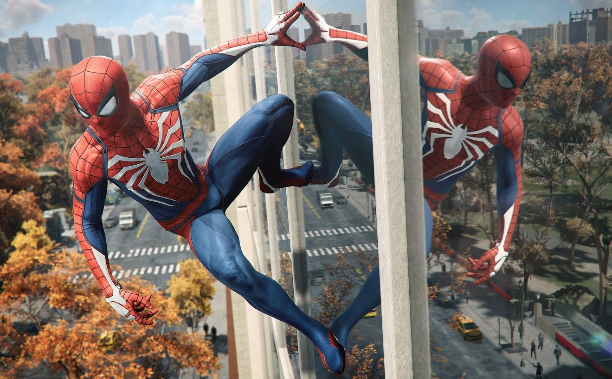

Закатывающиеся на двести семьдесят градусов глаза -- естественная физиологическая реакция на заявления вида "аппаратная платформа X тормозит прогресс". Прогресс ранее, как известно, тормозили сперва консоли в принципе, потом консоли Nintendo, теперь настала очередь Xbox Series S. Что вы сможете вынести для себя, вступив в беседу и попросив развернуть тезис? Скорее всего -- что ваш оппонент предпочитает для понятия "прогресс" еще более узкое определение, чем можно было бы предположить, разговаривая в контексте игровой индустрии, и, вероятно, выражает его через достаточно сиюминутные вещи вроде разрешения текстур и экрана или, скажем, частоты кадров.

Главная ошибка, которую вы можете допустить, решив ворваться в этот спор (я в целом не то чтобы рекомендую) -- принять эту систему координат. Сузив фокус с потенциального влияния дешевой консоли с подписочной моделью на индустрию в целом до пресловутого _графена_[^1] в AAA-играх -- вы будете вынуждены согласиться, что да, XSS -- lowest common denominator, не слишком захватывающая дух консоль, имеющая шанс стать бейзлайном поколения.

Куда интересней было бы поразмышлять, не бывает ли так, что новые техники появляются благодаря недостаточной производительности традиционных, а не потому что железо *позволяет*? Не важней ли иметь больше работающих в индустрии профессионалов _в принципе_, чем больше пикселей на экране _сейчас_? Что принесет индустрии потенциальное широкое принятие подписочной модели? Больше места для нишевых проектов, или окончательную фиксацию на энгейджменте[^2] в бесконечных роуглайках и баттлроялях?

Велп, не сегодня.

Сегодня примем, что ближайшие перспективы ААА-проектов нам интересны не менее. Что не так с Series S в этом, пусть даже и очень узком преломлении?

Обещание Xbox Series S элегантно: хотите сетап поскромнее? Хорошо, у нас для вас есть в несколько раз менее мощная консоль, выдающая в несколько раз меньше пикселей. Все остальное _такое же_. Простая математика. Ну, "несколько" в этом нарративе неопределенным образом колеблется где-то между цифрами 2 и 4, но центральная мысль ясна: тот же экспириенс на экране попроще.

Боязнь _торможения прогресса_ строится на опасении, что между консолями на практике не будет feature parity, и снижением разрешения все не закончится, а значит, и базовый дизайн тяжелых игр будет учитывать более слабую консоль (ну, или про нее забудут через пару лет, тоже вполне вероятное развитие событий).

Сommon wisdom подсказывает, что сокращая количество пикселей более-менее вровень с мощностью GPU --- мы, наверное, получаем достаточно безболезненное масштабирование: покупатели консоли подешевле получают те же игры, разработчики -- (почти) не получают дополнительной головной боли. Нагрузка на GPU ведь достаточно линейно масштабируется с количеством пикселей, а CPU-ворклоады -- это что-то, о чем мы привыкли думать "масштабируются вместе с фреймрейтом, а не с разрешением". Не совсем так по обоим пунктам, но если CPU нас особенно и не волнует -- в XSS почти такой же, как и в старшей консоли -- то для GPU мы привыкли думать о легком масштабировании вместе с разрешением именно потому что наши текущие пайплайны работают *вот так*.

Есть ли на горизонте изменения?

Ну, сложность рейтрейсинга (текущих его аппаратные имплементаций, по крайней мере) заметно масштабируется не только с разрешением, но и с _геометрической комплексностью сцены_: прежде чем собственно трассировать лучи, вам необходимо построить иерархическую модель сцены, BVH[^3] -- вы не хотите перебирать пересечение луча с каждым из миллиарда треугольников, вы хотите проверить, в какую часть сцены он уходит, затем -- в какую часть этой части, и так далее, пока вы не останетесь один на один с нодом, содержащим достаточное количество треугольников, чтобы просто перебрать их последовательно. Да, потом и производительность собственно трассировки заметно зависит от глубины поиска пересечения в BVH[^4].

Также теперь вам понадобится обновлять BVH при любой модификации сцены или даже полностью пересобирать его с нуля, если сцена изменилась _сильно_ (первое быстрее, чаще, и менее 
ффективно, второе -- медленнее и реже, но зато основательно; когда что применять -- пока еще не очень понятно). Если вы используете рейтрейсинг --- какой-то этап вашего пайплайна требует столько же ресурсов[^5] на в разы менее мощной платформе. У вас появляется проблема. Насколько серьезная?


_Настолько?.._

Devil May Cry 5 Special Edition не использует рейтрейсинг на Xbox Series S. По описанной выше причине? Не знаю. Может быть, может быть нет, но у меня есть некоторые подозрения. Если я угадал, то значит ли это, что рейтрейсинг на Series S неосуществим? Тоже нет. Это значит, что использование технологии, которая должна рендеринг упростить, снова только делает его чуть сложнее[^6]. Больше дыма и зеркал в борьбе с дымом и зеркалами.

\

{{}}

\

Да: сцена в отражении куда проще, потому что это, ну, другая сцена! Самый очевидный путь оптимизации -- проводить рейтрейсинг через упрощенный вариант сцены, это и так уже делают все или почти все. Естественным шагом было бы использовать в Series S сцену еще чуть проще, но вы не всегда получаете ее бесплатно. Опенворлды имеют несколько уровней LOD практически на каждый объект и вряд ли имеют здесь серьезные проблемы, играм покоридорнее же придется и посложнее.

Насколько технология масштабируема -- зависит еще и от того, что вы вкладываете в понятие "масштабируемость". Где-то это модификация пары переменных в конфигурационном файле, где-то -- небольшое допиливание кода под платформу послабее, где-то -- использование другого набора ассетов на платформе с меньшей производительностью, и эти ассеты могут у вас быть, а могут и потребовать дополнительных ресурсов на их создание. Где-то это, наконец, использование других техник, и вообще другой дизайн. Это понятное опасение.

Только с рейтрейсингом ли это опасение у нас есть?

Наверное, нет. Наверное, все, что плохо масштабируется вместе с разрешением -- под вопросом. Мне сразу же приходят в голову геометрия в принципе, работающие со сложной топлогией шейдеры, в конце концов воксельные структуры и используемые вне рейтрейсинга BVH и, наконец, микрополигональный и другой рендеринг, тяжело завязаный на виртуализацию и стриминг геометрии, и тяжело же задействующий шейдерные ядра для работы с ней (Unreal Engine V?.. Не знаю, очень надеюсь, что автоматическое масштабирование детализации под производительность -- большой его design goal).

Все это не новый какой-то вопрос, и не самое плохое развитие ситуации -- еще несколько месяцев назад большой целью Microsoft был полный или почти полный first party-кроссген с _Xbox One_ по крайней мере пару следующих лет, и... вы можете представить последствия _этого_. XSS медленнее, не слишком богат на память (и совсем не богат на ее пропускную способность), но хотя бы находится на одной волне со взрослыми консолями архитектурно (да, я вполне верю, что быстрый стриминг данных с SSD это важнейшая фича этого поколения).

Так все же: плох ли Series S для ближайших игр? Где грань между ребилдом в другой конфигурации и портированием на значительно более слабый таргет, и насколько новые видеоигры будут обречены на последнее?

Я не знаю, и отдельно по последнему пункту мне в целом довольно-таки все равно, движ мне уже много лет стократно интереснее, чем собственно видеоигры, особенно ААА; я никому не обещал, что этот пост закончится ответом на все вопросы.

[^1]: Какая мерзость.
[^2]: Сейчас для Game Pass игры подписывают, вроде бы, соглашаясь на фиксированной сумме.
[^3]: Bounding volume hierarchy.
[^4]: По сложной комбинации причин мы надеемся, что на следующих поколениях железа этот фактор станет гораздо менее заметным; просто поверьте мне здесь на слово.
[^5]: Не будем здесь об асинхронности и о вычислительной сложности: если вы более глубоко понимаете ситуацию -- то более глубоко понимаете и проблему, но сегодня попробуем простыми словами.
[^6]: _Чистый_ рейтрейсинг должен упростить многое в рендеринге; гибридные системы, использующие как растеризацию так и рейтрейсинг, пока выглядят дополнительным океаном боли для всех причастных, но это очевидно неизбежный переходный этап.
